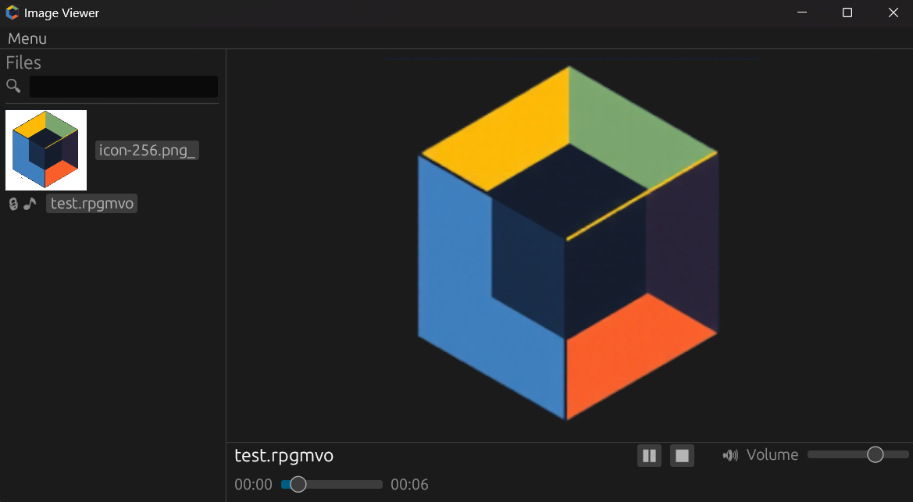

#  RPGM Viewer


A cross-platform desktop app for viewing, managing, and encrypting/decrypting images and audio files, with special support for RPG Maker encrypted formats (e.g., `.png_`, `.rpgmvp`, `.ogg_`, etc.). Built with Rust and powered by `egui`.



---

## Features

- **Image Viewing**: Display encrypted images.
- **Audio Playback**: Play audio files (OGG, M4A, MP3).
- **File Encryption/Decryption**: Encrypt and decrypt files using RPG Maker encryption schemes (MV/MZ versions).
- **File Browser**: Navigate directories, view thumbnails, and manage files with a clean UI.
- **Search**: Easily search for files and folders within the app.
- **Drag-and-Drop**: Open folders or files by dragging them into the app.
- **Customizable UI**: Adjust UI scale, font size, and thumbnail settings.
- **Cross-Platform**: Runs natively on Windows, Linux, macOS.

---

## Installation

You can either **download pre-built releases** or **build from source**. Choose the option that suits you best.

### Option 1: Download Pre-Built Releases

Visit the [Releases page](https://github.com/charl1e7/rpgm-viewer/releases) to download the latest version for your operating system. Extract the archive and run the executable.

#### Supported Versions

- **Windows**:
  - File: `rpgm_viewer-x86_64-pc-windows-msvc.exe `
- **Linux**:
  - File: `rpgm_viewer-unknown-linux-gnu`
- **macOS**:
  - File: `rpgm_viewer-aarch64-apple-darwin`.

### Option 2: Build from Source

If you prefer to compile the app yourself or need to customize it, follow these steps:

#### Steps

1. **Clone the Repository**:

   ```bash
   git clone https://github.com/charl1e7/rpgm-viewer.git
   cd rpgm-viewer/rpgm-viewer
   ```
2. **Build and Run Natively**:

   - For a release build:
     ```bash
     cargo build --release
     ```
   - Run the app:
     - Windows: `target\release\rpg_viewer.exe`
     - Linux/macOS: `./target/release/rpg_viewer`

---

## License

Licensed under the Apache 2.0 License.

---
